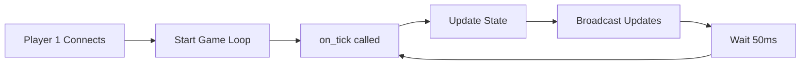

## What is the Game Loop?

The game loop is a background process that calls your `on_tick()` handler at a fixed rate (default 20 times per second). This is essential for:

- 🎮 **Game Physics** - Move objects, detect collisions
- ⏱️ **Timers** - Countdown timers, phase transitions
- 📊 **State Updates** - Update scores, health, positions
- 🎯 **Auto-events** - Spawn items, trigger events

## How It Works



The game loop runs independently of player actions, providing smooth, continuous updates.

## Basic Usage

### Step 1: Start the Game Loop

Start the loop when the first player connects:

```python
async def on_connect():
    player_name = request.get('player_name', 'Guest')
    room.join(request.get('room_id', 'lobby'), max_players=10)

    # Initialize state
    if not room.state:
        room.state = {
            'players': {},
            'game_phase': 'waiting',
            'last_update': time.time()
        }

    # Add player
    room.state['players'][session.player_id] = {
        'name': player_name,
        'x': 400,
        'y': 300
    }

    # Start game loop (only once)
    if not room.config.get('game_loop_started'):
        room.config['game_loop_started'] = True
        room.config['tick_rate'] = 20  # 20 ticks per second
        room.start_game_loop()

    await room.broadcast({
        'type': 'player_joined',
        'player_id': session.player_id,
        'player_name': player_name
    })

    return {
        'type': 'welcome',
        'your_id': session.player_id,
        'players': room.state['players']
    }
```

### Step 2: Define on_tick Handler

Implement game logic in `on_tick()`:

```python
async def on_tick():
    # Calculate delta time
    current_time = time.time()
    delta_time = current_time - room.state['last_update']
    room.state['last_update'] = current_time

    # Update game state here
    # ... your game logic ...

    # Broadcast updates to players
    await room.broadcast({
        'type': 'state_update',
        'data': room.state
    })
```

---

## Example: Moving Objects

Move objects smoothly using delta time:

```python
async def on_tick():
    current_time = time.time()
    delta_time = current_time - room.state.get('last_update', current_time)
    room.state['last_update'] = current_time

    # Move all objects
    for obj in room.state.get('objects', []):
        obj['x'] += obj['vx'] * delta_time
        obj['y'] += obj['vy'] * delta_time

        # Bounce off walls
        if obj['x'] < 0 or obj['x'] > 800:
            obj['vx'] *= -1
        if obj['y'] < 0 or obj['y'] > 600:
            obj['vy'] *= -1

    # Broadcast positions
    await room.broadcast({
        'type': 'objects_update',
        'objects': room.state['objects']
    })
```

---

## Example: Countdown Timer

Implement phase-based gameplay with timers:

```python
async def on_connect():
    if not room.state:
        room.state = {
            'players': {},
            'phase': 'waiting',
            'timer': 10.0,
            'last_update': time.time()
        }

    # Add player
    room.state['players'][session.player_id] = {
        'name': request.get('player_name', 'Guest'),
        'ready': False
    }

    # Start loop
    if not room.config.get('game_loop_started'):
        room.config['game_loop_started'] = True
        room.config['tick_rate'] = 20
        room.start_game_loop()

    await room.broadcast({
        'type': 'player_joined',
        'player_id': session.player_id
    })

    return {
        'type': 'welcome',
        'your_id': session.player_id,
        'phase': room.state['phase'],
        'timer': room.state['timer']
    }


async def on_tick():
    current_time = time.time()
    delta_time = current_time - room.state['last_update']
    room.state['last_update'] = current_time

    phase = room.state['phase']

    if phase == 'waiting':
        # Countdown to start
        room.state['timer'] -= delta_time

        if room.state['timer'] <= 0:
            room.state['phase'] = 'playing'
            room.state['timer'] = 60.0  # 60 second game

            await room.broadcast({
                'type': 'game_started',
                'timer': room.state['timer']
            })

    elif phase == 'playing':
        # Game timer
        room.state['timer'] -= delta_time

        # Broadcast every second
        if int(room.state['timer']) != int(room.state['timer'] + delta_time):
            await room.broadcast({
                'type': 'timer_update',
                'timer': int(room.state['timer'])
            })

        # Game over
        if room.state['timer'] <= 0:
            room.state['phase'] = 'finished'

            await room.broadcast({
                'type': 'game_over'
            })
```

---

## Example: Aviator Game

Full implementation of a crash game with automatic rounds:

```python
async def on_connect():
    if not room.state:
        room.state = {
            'players': {},
            'phase': 'waiting_for_players',
            'multiplier': 1.0,
            'crash_point': 0,
            'round': 1,
            'timer': 5.0,
            'last_update': time.time(),
            'min_players': 2
        }

    # Add player
    room.state['players'][session.player_id] = {
        'name': request.get('player_name', 'Guest'),
        'balance': 1000,
        'bet': 0,
        'has_bet': False,
        'cashed_out': False
    }

    # Check if enough players
    if room.state['phase'] == 'waiting_for_players':
        if len(room.state['players']) >= room.state['min_players']:
            room.state['phase'] = 'waiting'
            room.state['timer'] = 5.0

            await room.broadcast({
                'type': 'game_starting',
                'timer': 5
            })

    # Start loop
    if not room.config.get('game_loop_started'):
        room.config['game_loop_started'] = True
        room.config['tick_rate'] = 20
        room.start_game_loop()

    return {
        'type': 'welcome',
        'your_id': session.player_id,
        'players': room.state['players'],
        'phase': room.state['phase'],
        'round': room.state['round']
    }


async def on_message():
    action = request.get('action')

    if action == 'place_bet':
        amount = request.get('amount', 0)
        player = room.state['players'][session.player_id]

        if room.state['phase'] != 'betting':
            return {'error': 'Cannot bet now'}

        if player['has_bet']:
            return {'error': 'Already placed bet'}

        if amount > player['balance']:
            return {'error': 'Insufficient balance'}

        # Place bet
        player['balance'] -= amount
        player['bet'] = amount
        player['has_bet'] = True

        await room.broadcast({
            'type': 'bet_placed',
            'player_id': session.player_id,
            'amount': amount
        })

        return {'type': 'bet_confirmed', 'balance': player['balance']}

    elif action == 'cashout':
        player = room.state['players'][session.player_id]

        if room.state['phase'] != 'flying':
            return {'error': 'No active round'}

        if not player['has_bet'] or player['cashed_out']:
            return {'error': 'No active bet'}

        # Calculate winnings
        multiplier = room.state['multiplier']
        winnings = int(player['bet'] * multiplier)
        player['balance'] += winnings
        player['cashed_out'] = True

        await room.broadcast({
            'type': 'player_cashed_out',
            'player_id': session.player_id,
            'multiplier': round(multiplier, 2),
            'winnings': winnings
        })

        return {
            'type': 'cashout_success',
            'multiplier': round(multiplier, 2),
            'winnings': winnings
        }


async def on_tick():
    current_time = time.time()
    delta_time = current_time - room.state['last_update']
    room.state['last_update'] = current_time

    phase = room.state['phase']

    # Don't tick if waiting for players
    if phase == 'waiting_for_players':
        return

    if phase == 'waiting':
        # Countdown to betting
        room.state['timer'] -= delta_time

        if room.state['timer'] <= 0:
            room.state['phase'] = 'betting'
            room.state['timer'] = 10.0

            await room.broadcast({
                'type': 'betting_started',
                'round': room.state['round']
            })

    elif phase == 'betting':
        # Betting countdown
        room.state['timer'] -= delta_time

        if room.state['timer'] <= 0:
            room.state['phase'] = 'flying'
            room.state['multiplier'] = 1.0

            # Generate random crash point
            rand = random.random()
            if rand < 0.3:
                room.state['crash_point'] = 1.0 + random.random() * 0.5
            elif rand < 0.6:
                room.state['crash_point'] = 1.5 + random.random() * 1.0
            else:
                room.state['crash_point'] = 2.5 + random.random() * 7.5

            await room.broadcast({
                'type': 'round_started',
                'round': room.state['round']
            })

    elif phase == 'flying':
        # Increase multiplier
        growth = 0.1 * (1 + room.state['multiplier'] * 0.05)
        room.state['multiplier'] += growth * delta_time

        await room.broadcast({
            'type': 'multiplier_update',
            'multiplier': round(room.state['multiplier'], 2)
        })

        # Check crash
        if room.state['multiplier'] >= room.state['crash_point']:
            room.state['phase'] = 'crashed'

            # Process losses
            for player in room.state['players'].values():
                if player['has_bet'] and not player['cashed_out']:
                    pass  # They lost
                player['has_bet'] = False
                player['cashed_out'] = False
                player['bet'] = 0

            await room.broadcast({
                'type': 'plane_crashed',
                'crash_multiplier': round(room.state['crash_point'], 2)
            })

            # Next round
            room.state['round'] += 1
            room.state['phase'] = 'waiting'
            room.state['timer'] = 5.0


async def on_disconnect():
    if session.player_id in room.state['players']:
        del room.state['players'][session.player_id]

        await room.broadcast({
            'type': 'player_left',
            'player_id': session.player_id
        })

    if room.get_player_count() == 0:
        room.destroy()
```

---

## Performance Tips

<AccordionGroup>
  <Accordion title="Use Delta Time" icon="clock">
    Always calculate `delta_time` to ensure consistent behavior regardless of tick rate:
    ```python
    delta_time = current_time - room.state['last_update']
    position += velocity * delta_time
    ```
  </Accordion>

  <Accordion title="Optimize Broadcast Frequency" icon="signal">
    Don't broadcast on every tick if not needed. Use a counter:
    ```python
    if not hasattr(room, '_tick_counter'):
        room._tick_counter = 0

    room._tick_counter += 1

    # Only broadcast every 5 ticks (4 times per second)
    if room._tick_counter % 5 == 0:
        await room.broadcast({'type': 'update', 'data': room.state})
    ```
  </Accordion>

  <Accordion title="Adjust Tick Rate" icon="gauge">
    Set tick rate based on your game needs:
    - **Fast-paced games**: 30-60 ticks/second
    - **Normal games**: 20 ticks/second (default)
    - **Turn-based games**: 5-10 ticks/second

    ```python
    room.config['tick_rate'] = 30  # 30 ticks per second
    ```
  </Accordion>

  <Accordion title="Stop Loop When Inactive" icon="pause">
    Stop the loop when no players are active:
    ```python
    async def on_disconnect():
        if room.get_player_count() == 0:
            room.stop_game_loop()
            room.destroy()
    ```
  </Accordion>
</AccordionGroup>

---

## Next Steps

<CardGroup cols={2}>
  <Card title="API Reference" icon="code" href="/multiplayer/api-reference">
    Complete API documentation
  </Card>
  <Card title="Examples" icon="book" href="/multiplayer/examples">
    See more complete game examples
  </Card>
</CardGroup>
