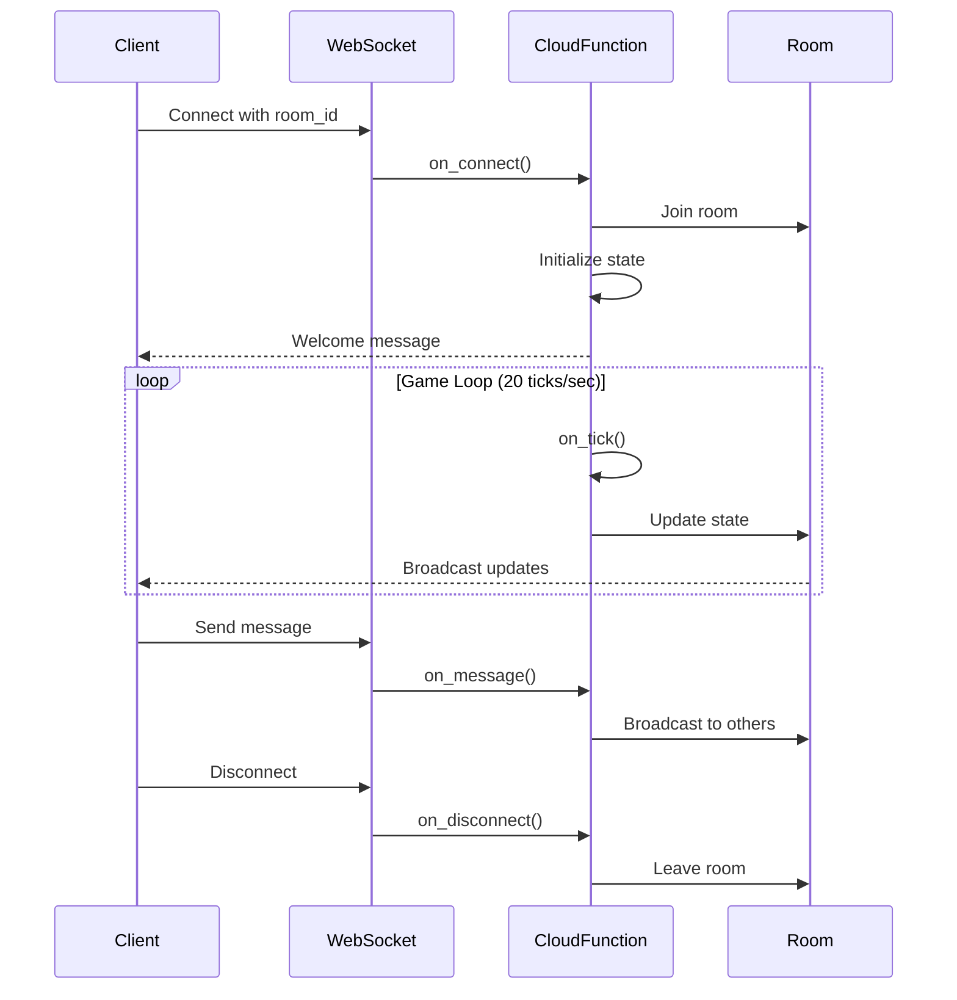

## What is Multiplayer?

CocoCloud's multiplayer feature allows you to build real-time, multi-player experiences using WebSocket cloud functions. Perfect for:

- 🎮 **Multiplayer Games** - Build games like Aviator, racing games, card games
- 💬 **Real-time Chat** - Create chat rooms and messaging apps
- 📊 **Collaborative Tools** - Build collaborative whiteboards, document editors
- 🎯 **Live Events** - Create interactive live events and competitions

## Key Features

<CardGroup cols={2}>
  <Card title="Room-Based Architecture" icon="door-open">
    Players automatically join rooms with configurable player limits and state management
  </Card>
  <Card title="Game Loop System" icon="rotate">
    Built-in game loop with configurable tick rates (default 20 ticks/second)
  </Card>
  <Card title="Real-time Broadcasting" icon="broadcast-tower">
    Broadcast messages to all players in a room with selective targeting
  </Card>
  <Card title="State Management" icon="database">
    Shared room state accessible to all players with automatic synchronization
  </Card>
  <Card title="Session Management" icon="user">
    Per-player session data for storing user-specific information
  </Card>
  <Card title="Rate Limiting" icon="shield">
    Built-in rate limiting (60 messages/second per player)
  </Card>
</CardGroup>

## How It Works

## Quick Start

<Steps>
  <Step title="Create WebSocket Function">
    Create a new cloud function with type `websocket`
  </Step>
  <Step title="Define Event Handlers">
    Implement `on_connect`, `on_message`, `on_disconnect`, and optionally `on_tick`
  </Step>
  <Step title="Connect from Client">
    Use WebSocket client to connect and send/receive messages
  </Step>
</Steps>

## Next Steps

<CardGroup cols={2}>
  <Card title="Quick Start Guide" icon="rocket" href="/multiplayer/quickstart">
    Get started with your first multiplayer function
  </Card>
  <Card title="API Reference" icon="code" href="/multiplayer/api-reference">
    Complete API documentation
  </Card>
  <Card title="Examples" icon="book" href="/multiplayer/examples">
    Full example games and applications
  </Card>
  <Card title="Best Practices" icon="star" href="/multiplayer/best-practices">
    Tips for building scalable multiplayer apps
  </Card>
</CardGroup>
